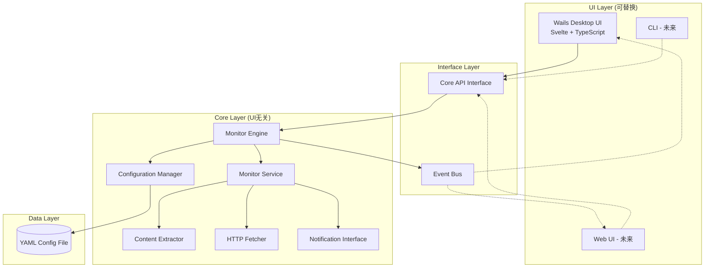
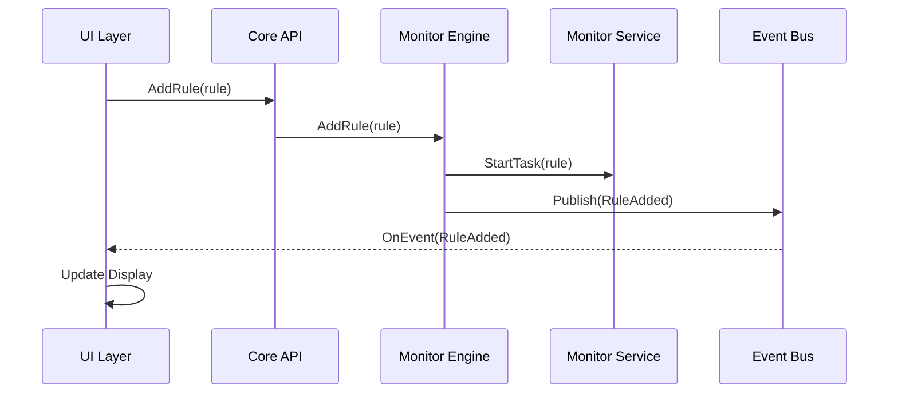
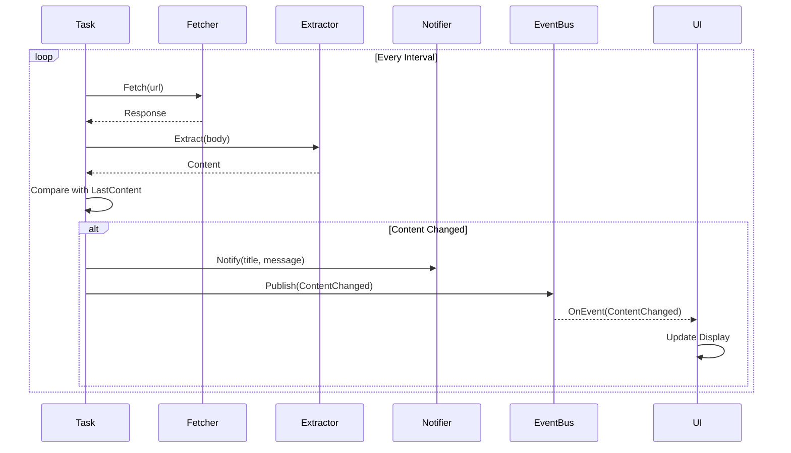

# 设计文档

## 概述

URL内容监控器是一个使用Go语言开发的跨平台桌面应用程序。应用采用分层架构设计，核心业务逻辑与UI层完全解耦，通过清晰的接口层进行交互。这种设计使得应用可以轻松更换UI框架或扩展为C/S架构。核心使用并发模型来处理多个监控任务，通过goroutine和channel实现高效的任务调度和状态管理。

### 架构原则

1. **核心逻辑独立**: 所有业务逻辑（监控、提取、通知）不依赖任何UI框架
2. **接口驱动**: 通过定义清晰的接口实现组件间的松耦合
3. **可扩展性**: 支持多种UI实现（桌面GUI、Web UI、CLI）和部署模式（单机、C/S）
4. **事件驱动**: 使用事件/回调机制实现核心层向UI层的通知

### 技术栈

**核心层（UI无关）**:
- **HTTP客户端**: 标准库 net/http
- **HTML解析**: goquery (CSS选择器支持)
- **JSON处理**: gjson (JSON路径查询)
- **配置存储**: YAML文件
- **YAML解析**: gopkg.in/yaml.v3
- **日志**: 标准库 log/slog

**UI层（可替换）**:
- **桌面UI**: Wails v2 (Go + Web技术栈的跨平台GUI框架) - 默认实现
- **前端**: Svelte + TypeScript + Vite
- **系统通知**: 抽象接口，Wails runtime实现为默认
- **未来可选**: 纯Web UI (Gin/Echo + WebSocket)、CLI、gRPC API

## 架构

### 整体架构图



### 分层说明

1. **UI层（可替换）**: 
   - 多种UI实现（Fyne桌面、Web、CLI等）
   - 通过统一的Core API接口与核心层交互
   - 不包含任何业务逻辑

2. **接口层**: 
   - Core API: 提供统一的业务操作接口
   - Event Bus: 事件总线，用于核心层向UI层推送状态变化

3. **核心层（UI无关）**: 
   - Monitor Engine: 核心引擎，协调所有服务
   - 所有业务逻辑组件（监控、提取、配置等）
   - 完全独立，可单独测试和部署

4. **数据层**: 
   - 配置持久化
   - 可扩展为数据库存储（支持C/S架构）

## 组件和接口

### 1. 数据模型 (models/rule.go)

```go
// MonitorRule 监控规则
type MonitorRule struct {
    ID              string            `json:"id" yaml:"id"`
    Name            string            `json:"name" yaml:"name"`
    Description     string            `json:"description" yaml:"description"`
    URL             string            `json:"url" yaml:"url"`
    Method          string            `json:"method" yaml:"method"`                    // HTTP方法：GET, POST, PUT等
    Headers         map[string]string `json:"headers,omitempty" yaml:"headers,omitempty"` // 自定义HTTP头
    Body            string            `json:"body,omitempty" yaml:"body,omitempty"`    // 请求体（POST/PUT等）
    Interval        time.Duration     `json:"interval" yaml:"interval"`                // 检查间隔（如：5m, 1h, 30s）
    ExtractorType   ExtractorType     `json:"extractor_type" yaml:"extractor_type"`
    ExtractorExpr   string            `json:"extractor_expr" yaml:"extractor_expr"`
    NotifyEnabled   bool              `json:"notify_enabled" yaml:"notify_enabled"`
    Enabled         bool              `json:"enabled" yaml:"enabled"`
    LastContent     string            `json:"last_content" yaml:"last_content"`
    LastChecked     time.Time         `json:"last_checked" yaml:"last_checked"`
    Status          RuleStatus        `json:"status" yaml:"status"`
    ErrorMessage    string            `json:"error_message,omitempty" yaml:"error_message,omitempty"`
}

// ExtractorType 提取器类型
type ExtractorType string

const (
    ExtractorCSS   ExtractorType = "css"
    ExtractorRegex ExtractorType = "regex"
    ExtractorJSON  ExtractorType = "json"
)

// RuleStatus 规则状态
type RuleStatus string

const (
    StatusRunning RuleStatus = "running"
    StatusPaused  RuleStatus = "paused"
    StatusError   RuleStatus = "error"
    StatusIdle    RuleStatus = "idle"
)

// DefaultMethod 默认HTTP方法
const DefaultMethod = "GET"

// Validate 验证规则的有效性
func (r *MonitorRule) Validate() error {
    if r.Name == "" {
        return errors.New("规则名称不能为空")
    }
    if r.URL == "" {
        return errors.New("URL不能为空")
    }
    if _, err := url.Parse(r.URL); err != nil {
        return fmt.Errorf("无效的URL: %w", err)
    }
    if r.Method == "" {
        r.Method = DefaultMethod
    }
    if r.Interval < time.Second {
        return errors.New("检查间隔不能小于1秒")
    }
    if r.ExtractorExpr == "" {
        return errors.New("提取表达式不能为空")
    }
    return nil
}
```

### 2. 配置管理器 (config/manager.go)

```go
type Manager interface {
    // Load 加载所有规则
    Load() ([]*models.MonitorRule, error)
    
    // Save 保存所有规则
    Save(rules []*models.MonitorRule) error
    
    // AddRule 添加新规则
    AddRule(rule *models.MonitorRule) error
    
    // UpdateRule 更新规则
    UpdateRule(rule *models.MonitorRule) error
    
    // DeleteRule 删除规则
    DeleteRule(id string) error
    
    // GetRule 获取单个规则
    GetRule(id string) (*models.MonitorRule, error)
}
```

**实现要点**:
- 使用YAML文件存储配置（默认路径: ~/.url-monitor/config.yaml）
- 使用文件锁防止并发写入冲突
- 提供配置文件的备份和恢复机制

### 3. 内容提取器 (extractor/extractor.go)

```go
type Extractor interface {
    // Extract 从响应中提取内容
    Extract(body []byte, contentType string) (string, error)
}

// Factory 提取器工厂
type Factory struct{}

func (f *Factory) Create(extractorType models.ExtractorType, expr string) (Extractor, error)
```

**实现类**:
- `CSSExtractor`: 使用goquery解析HTML并应用CSS选择器
- `RegexExtractor`: 使用regexp包匹配正则表达式
- `JSONExtractor`: 使用gjson解析JSON并提取路径

### 4. HTTP客户端 (fetcher/fetcher.go)

```go
// Request HTTP请求参数
type Request struct {
    URL     string
    Method  string
    Headers map[string]string
    Body    string
}

// Response HTTP响应
type Response struct {
    Body        []byte
    ContentType string
    StatusCode  int
}

// Fetcher HTTP客户端接口
type Fetcher interface {
    // Fetch 发送HTTP请求并获取响应
    Fetch(req *Request) (*Response, error)
}
```

**实现要点**:
- 设置合理的超时时间（30秒）
- 支持自定义HTTP头
- 支持多种HTTP方法（GET、POST、PUT、DELETE等）
- 支持请求体（用于POST/PUT等）
- 处理重定向
- 错误重试机制（最多3次）
- 设置默认User-Agent

### 5. 监控任务 (monitor/task.go)

```go
type Task struct {
    rule      *models.MonitorRule
    fetcher   fetcher.Fetcher
    extractor extractor.Extractor
    notifier  notification.Notifier
    stopCh    chan struct{}
    ticker    *time.Ticker
}

func (t *Task) Start() error
func (t *Task) Stop()
func (t *Task) Update(rule *models.MonitorRule) error
func (t *Task) RunOnce() error
```

**工作流程**:
1. 使用ticker按间隔触发检查
2. 调用Fetcher获取URL内容
3. 使用Extractor提取内容
4. 比较新旧内容，检测变化
5. 如果有变化且通知已启用，调用Notifier
6. 更新规则的LastContent和LastChecked

### 6. 监控服务 (monitor/service.go)

```go
type Service interface {
    // StartTask 启动监控任务
    StartTask(rule *models.MonitorRule) error
    
    // StopTask 停止监控任务
    StopTask(ruleID string) error
    
    // StopAll 停止所有任务
    StopAll()
    
    // UpdateTask 更新任务配置
    UpdateTask(rule *models.MonitorRule) error
    
    // RunTaskOnce 手动执行一次检查
    RunTaskOnce(ruleID string) error
    
    // GetTaskStatus 获取任务状态
    GetTaskStatus(ruleID string) models.RuleStatus
}
```

**实现要点**:
- 使用map存储活跃的任务（key为规则ID）
- 使用sync.RWMutex保护并发访问
- 每个任务在独立的goroutine中运行
- 提供任务生命周期管理

### 7. 通知服务 (notification/notifier.go)

```go
// Notifier 通知接口（抽象，不依赖具体UI）
type Notifier interface {
    // Notify 发送通知
    Notify(title, message string) error
}
```

**实现类**:
- `FyneNotifier`: 使用Fyne的notification包（桌面UI）
- `WebSocketNotifier`: 通过WebSocket推送（Web UI）
- `NoOpNotifier`: 空实现（CLI或无通知场景）

**实现要点**:
- 核心层只依赖Notifier接口
- 具体实现由UI层提供并注入
- 限制消息长度（最多200字符）
- 处理通知发送失败的情况

### 8. UI层实现 (ui/wails/)

#### Wails应用结构

Wails使用Go后端 + Web前端的架构：
- **Go后端**: 提供绑定方法供前端调用
- **Web前端**: Vue 3 + TypeScript，通过Wails runtime调用后端方法

#### Wails应用入口 (app.go)

```go
// App Wails应用结构
type App struct {
    ctx      context.Context
    coreAPI  core.CoreAPI
    eventBus core.EventBus
}

// NewApp 创建应用实例
func NewApp(coreAPI core.CoreAPI, eventBus core.EventBus) *App

// startup 应用启动时调用
func (a *App) startup(ctx context.Context)

// shutdown 应用关闭时调用
func (a *App) shutdown(ctx context.Context)

// domReady DOM加载完成时调用
func (a *App) domReady(ctx context.Context)
```

#### 绑定方法 (bindings.go)

这些方法会自动暴露给前端JavaScript调用：

```go
// GetRules 获取所有规则
func (a *App) GetRules() ([]*models.MonitorRule, error)

// GetRule 获取单个规则
func (a *App) GetRule(id string) (*models.MonitorRule, error)

// AddRule 添加规则
func (a *App) AddRule(rule *models.MonitorRule) error

// UpdateRule 更新规则
func (a *App) UpdateRule(rule *models.MonitorRule) error

// DeleteRule 删除规则
func (a *App) DeleteRule(id string) error

// StartMonitoring 启动监控
func (a *App) StartMonitoring(ruleID string) error

// StopMonitoring 停止监控
func (a *App) StopMonitoring(ruleID string) error

// CheckNow 立即检查
func (a *App) CheckNow(ruleID string) error

// EmitEvent 向前端发送事件
func (a *App) EmitEvent(event core.Event)
```

#### 前端结构 (frontend/)

```
frontend/
├── src/
│   ├── App.svelte           # 主应用组件
│   ├── main.ts              # 入口文件
│   ├── components/
│   │   ├── RuleList.svelte  # 规则列表组件
│   │   ├── RuleDetail.svelte # 规则详情组件
│   │   ├── RuleDialog.svelte # 规则编辑对话框
│   │   └── Toolbar.svelte   # 工具栏组件
│   ├── stores/
│   │   └── rules.ts         # Svelte stores状态管理
│   ├── types/
│   │   └── models.ts        # TypeScript类型定义
│   └── wailsjs/             # Wails自动生成的绑定
│       └── go/
│           └── main/
│               └── App.js   # Go方法的JS绑定
├── index.html
├── package.json
├── tsconfig.json
├── svelte.config.js
└── vite.config.ts
```

#### 主界面布局 (App.svelte)

```svelte
<script lang="ts">
  import Toolbar from './components/Toolbar.svelte'
  import RuleList from './components/RuleList.svelte'
  import RuleDetail from './components/RuleDetail.svelte'
  import RuleDialog from './components/RuleDialog.svelte'
  import { rulesStore } from './stores/rules'
  
  let showDialog = false
  let editingRule = null
  
  function showAddDialog() {
    editingRule = null
    showDialog = true
  }
  
  function editRule(rule) {
    editingRule = rule
    showDialog = true
  }
</script>

<div class="app-container">
  <Toolbar on:add-rule={showAddDialog} on:refresh={rulesStore.loadRules} />
  <div class="main-content">
    <RuleList 
      rules={$rulesStore.rules}
      selectedId={$rulesStore.selectedRuleId}
      on:select={(e) => rulesStore.selectRule(e.detail)}
      on:edit={(e) => editRule(e.detail)}
      on:delete={(e) => rulesStore.deleteRule(e.detail)}
      on:toggle={(e) => rulesStore.toggleRule(e.detail)}
    />
    {#if $rulesStore.selectedRule}
      <RuleDetail 
        rule={$rulesStore.selectedRule}
        on:check-now={(e) => rulesStore.checkNow(e.detail)}
      />
    {/if}
  </div>
  {#if showDialog}
    <RuleDialog 
      rule={editingRule}
      on:save={(e) => { rulesStore.saveRule(e.detail); showDialog = false }}
      on:cancel={() => showDialog = false}
    />
  {/if}
</div>
```

**布局**:
- 顶部: 工具栏（添加、刷新按钮）
- 左侧: 规则列表（显示名称、状态、最后检查时间）
- 右侧: 详情面板（显示选中规则的完整信息和提取内容）
- 弹窗: 规则编辑对话框

#### 规则列表组件 (RuleList.svelte)

```svelte
<script lang="ts">
  import { createEventDispatcher } from 'svelte'
  import type { MonitorRule } from '../types/models'
  
  export let rules: MonitorRule[]
  export let selectedId: string | null
  
  const dispatch = createEventDispatcher()
  
  function formatTime(time: string): string {
    return new Date(time).toLocaleString()
  }
</script>

<div class="rule-list">
  {#each rules as rule (rule.id)}
    <div 
      class="rule-item"
      class:selected={rule.id === selectedId}
      on:click={() => dispatch('select', rule.id)}
    >
      <div class="rule-header">
        <span class="rule-name">{rule.name}</span>
        <span class="status-badge {rule.status}">{rule.status}</span>
      </div>
      <div class="rule-info">
        <span class="url">{rule.url}</span>
        <span class="last-checked">{formatTime(rule.last_checked)}</span>
      </div>
      <div class="rule-actions">
        <button on:click|stopPropagation={() => dispatch('toggle', rule.id)}>
          {rule.enabled ? '暂停' : '启动'}
        </button>
        <button on:click|stopPropagation={() => dispatch('edit', rule)}>编辑</button>
        <button on:click|stopPropagation={() => dispatch('delete', rule.id)}>删除</button>
      </div>
    </div>
  {/each}
</div>
```

#### 规则编辑对话框 (RuleDialog.svelte)

```svelte
<script lang="ts">
  import { createEventDispatcher } from 'svelte'
  import type { MonitorRule } from '../types/models'
  
  export let rule: MonitorRule | null
  
  const dispatch = createEventDispatcher()
  
  let formData = {
    name: rule?.name || '',
    description: rule?.description || '',
    url: rule?.url || '',
    method: rule?.method || 'GET',
    interval: rule?.interval || '5m',
    extractor_type: rule?.extractor_type || 'css',
    extractor_expr: rule?.extractor_expr || '',
    notify_enabled: rule?.notify_enabled ?? true,
    enabled: rule?.enabled ?? true
  }
  
  function handleSubmit() {
    dispatch('save', { ...rule, ...formData })
  }
</script>

<div class="dialog-overlay">
  <div class="dialog">
    <h2>{rule?.id ? '编辑规则' : '添加规则'}</h2>
    <form on:submit|preventDefault={handleSubmit}>
      <div class="form-group">
        <label>规则名称 *</label>
        <input bind:value={formData.name} required />
      </div>
      <div class="form-group">
        <label>描述</label>
        <textarea bind:value={formData.description} />
      </div>
      <div class="form-group">
        <label>URL *</label>
        <input bind:value={formData.url} type="url" required />
      </div>
      <div class="form-group">
        <label>HTTP方法</label>
        <select bind:value={formData.method}>
          <option value="GET">GET</option>
          <option value="POST">POST</option>
          <option value="PUT">PUT</option>
          <option value="DELETE">DELETE</option>
        </select>
      </div>
      <div class="form-group">
        <label>检查间隔 *</label>
        <input bind:value={formData.interval} placeholder="例如: 5m, 1h" required />
      </div>
      <div class="form-group">
        <label>提取器类型</label>
        <select bind:value={formData.extractor_type}>
          <option value="css">CSS选择器</option>
          <option value="regex">正则表达式</option>
          <option value="json">JSON路径</option>
        </select>
      </div>
      <div class="form-group">
        <label>提取表达式 *</label>
        <input bind:value={formData.extractor_expr} required />
      </div>
      <div class="form-group checkbox">
        <label>
          <input type="checkbox" bind:checked={formData.notify_enabled} />
          启用通知
        </label>
      </div>
      <div class="form-group checkbox">
        <label>
          <input type="checkbox" bind:checked={formData.enabled} />
          启用规则
        </label>
      </div>
      <div class="dialog-actions">
        <button type="submit">保存</button>
        <button type="button" on:click={() => dispatch('cancel')}>取消</button>
      </div>
    </form>
  </div>
</div>
```

#### 状态管理 (stores/rules.ts)

```typescript
import { writable, derived } from 'svelte/store'
import { GetRules, AddRule, UpdateRule, DeleteRule, StartMonitoring, StopMonitoring, CheckNow } from '../wailsjs/go/main/App'
import { EventsOn } from '../wailsjs/runtime/runtime'
import type { MonitorRule } from '../types/models'

function createRulesStore() {
  const { subscribe, set, update } = writable<{
    rules: MonitorRule[]
    selectedRuleId: string | null
  }>({
    rules: [],
    selectedRuleId: null
  })
  
  return {
    subscribe,
    
    async loadRules() {
      const rules = await GetRules()
      update(state => ({ ...state, rules }))
    },
    
    async addRule(rule: MonitorRule) {
      await AddRule(rule)
      await this.loadRules()
    },
    
    async updateRule(rule: MonitorRule) {
      await UpdateRule(rule)
      await this.loadRules()
    },
    
    async deleteRule(id: string) {
      await DeleteRule(id)
      update(state => ({
        ...state,
        selectedRuleId: state.selectedRuleId === id ? null : state.selectedRuleId
      }))
      await this.loadRules()
    },
    
    async toggleRule(id: string) {
      const state = await new Promise<any>(resolve => {
        const unsubscribe = subscribe(s => {
          resolve(s)
          unsubscribe()
        })
      })
      
      const rule = state.rules.find((r: MonitorRule) => r.id === id)
      if (rule) {
        if (rule.enabled) {
          await StopMonitoring(id)
        } else {
          await StartMonitoring(id)
        }
        await this.loadRules()
      }
    },
    
    async checkNow(id: string) {
      await CheckNow(id)
    },
    
    selectRule(id: string) {
      update(state => ({ ...state, selectedRuleId: id }))
    },
    
    setupEventListeners() {
      // 监听后端事件
      EventsOn('rule_updated', () => {
        this.loadRules()
      })
      
      EventsOn('content_changed', (event: any) => {
        console.log('Content changed:', event)
        this.loadRules()
      })
    }
  }
}

export const rulesStore = createRulesStore()

// 派生store：获取当前选中的规则
export const selectedRule = derived(
  rulesStore,
  $rulesStore => $rulesStore.rules.find(r => r.id === $rulesStore.selectedRuleId) || null
)
```

#### Wails通知实现 (notifier.go)

```go
type WailsNotifier struct {
    ctx context.Context
}

func NewWailsNotifier(ctx context.Context) *WailsNotifier

// Notify 实现Notifier接口，使用Wails runtime发送系统通知
func (n *WailsNotifier) Notify(title, message string) error {
    runtime.MessageDialog(n.ctx, runtime.MessageDialogOptions{
        Type:    runtime.InfoDialog,
        Title:   title,
        Message: message,
    })
    return nil
}
```

### 9. 核心引擎和API接口 (core/engine.go, core/api.go)

#### Core API接口（UI层调用）

```go
// CoreAPI 核心API接口，UI层通过此接口与核心层交互
type CoreAPI interface {
    // 规则管理
    GetRules() ([]*models.MonitorRule, error)
    GetRule(id string) (*models.MonitorRule, error)
    AddRule(rule *models.MonitorRule) error
    UpdateRule(rule *models.MonitorRule) error
    DeleteRule(id string) error
    
    // 监控控制
    StartMonitoring(ruleID string) error
    StopMonitoring(ruleID string) error
    StopAllMonitoring() error
    CheckNow(ruleID string) error
    
    // 事件订阅
    Subscribe(listener EventListener)
    Unsubscribe(listener EventListener)
    
    // 生命周期
    Initialize() error
    Shutdown() error
}
```

#### 事件总线（核心层向UI层推送）

```go
// EventType 事件类型
type EventType string

const (
    EventRuleAdded      EventType = "rule_added"
    EventRuleUpdated    EventType = "rule_updated"
    EventRuleDeleted    EventType = "rule_deleted"
    EventRuleStatusChanged EventType = "rule_status_changed"
    EventContentChanged EventType = "content_changed"
    EventMonitorError   EventType = "monitor_error"
)

// Event 事件
type Event struct {
    Type      EventType
    RuleID    string
    Rule      *models.MonitorRule
    Timestamp time.Time
    Data      interface{}
}

// EventListener 事件监听器接口
type EventListener interface {
    OnEvent(event Event)
}

// EventBus 事件总线
type EventBus interface {
    Publish(event Event)
    Subscribe(listener EventListener)
    Unsubscribe(listener EventListener)
}
```

#### Monitor Engine实现

```go
type Engine struct {
    configMgr  config.Manager
    monitorSvc monitor.Service
    eventBus   EventBus
    notifier   notification.Notifier
    rules      []*models.MonitorRule
    mu         sync.RWMutex
}

func NewEngine(configMgr config.Manager, monitorSvc monitor.Service, notifier notification.Notifier) *Engine
func (e *Engine) Initialize() error
func (e *Engine) Shutdown() error
// 实现CoreAPI接口的所有方法
```

**设计要点**:
- Engine是CoreAPI的实现，完全独立于UI
- 通过EventBus向UI层推送状态变化
- UI层通过CoreAPI调用业务逻辑
- 支持多个UI同时连接（通过多个EventListener）

## 数据模型

### 配置文件结构 (config.yaml)

```yaml
version: "1.0"
rules:
  - id: uuid-1
    name: 示例监控
    description: 监控示例网站的内容变化
    url: https://example.com/api/data
    method: POST
    headers:
      Content-Type: application/json
      Authorization: Bearer token123
      User-Agent: URL-Monitor/1.0
    body: '{"query": "latest"}'
    interval: 5m  # 支持：s(秒), m(分钟), h(小时)
    extractor_type: json
    extractor_expr: data.items[0].title
    notify_enabled: true
    enabled: true
    last_content: "..."
    last_checked: "2025-11-13T10:00:00Z"
    status: running
  
  - id: uuid-2
    name: 简单GET请求
    description: 监控网页标题
    url: https://example.com
    method: GET  # 默认方法
    interval: 10m
    extractor_type: css
    extractor_expr: "h1.title"
    notify_enabled: true
    enabled: true
    last_content: ""
    last_checked: "0001-01-01T00:00:00Z"
    status: idle
```

### Duration格式说明

Interval字段使用Go的time.Duration格式：
- `30s` - 30秒
- `5m` - 5分钟
- `1h` - 1小时
- `1h30m` - 1小时30分钟
- `2h45m30s` - 2小时45分30秒

## 错误处理

### 错误类型

1. **网络错误**: HTTP请求失败、超时、DNS解析失败
2. **提取错误**: CSS选择器无匹配、正则表达式错误、JSON路径无效
3. **配置错误**: 配置文件损坏、权限不足
4. **系统错误**: 通知发送失败、文件IO错误

### 错误处理策略

- **网络错误**: 记录错误，更新规则状态为error，在下一个周期自动重试
- **提取错误**: 记录错误信息，保持上次成功的内容，不发送通知
- **配置错误**: 在UI中显示错误对话框，提供修复建议
- **系统错误**: 记录日志，降级处理（如通知失败不影响监控）

### 日志记录

- 使用标准库log/slog包
- 日志级别: Debug, Info, Warn, Error
- 日志文件位置: ~/.url-monitor/logs/app.log
- 日志格式: JSON格式，便于解析和分析
- 日志轮转: 每个文件最大10MB，保留最近5个文件
- 同时输出到文件和控制台（开发模式）

## 并发模型

### Goroutine使用

1. **主goroutine**: 运行Fyne UI事件循环
2. **任务goroutine**: 每个活跃的监控规则一个goroutine
3. **HTTP请求**: 在任务goroutine中同步执行（简化错误处理）

### 同步机制

- **规则列表**: 使用sync.RWMutex保护读写
- **任务map**: 使用sync.RWMutex保护并发访问
- **配置文件**: 使用文件锁防止多进程冲突
- **任务停止**: 使用channel (stopCh) 通知goroutine退出

### 数据流

#### UI调用核心层



#### 核心层监控流程



## 测试策略

### 单元测试

**测试框架**:
- 使用 `testify` 包进行断言和测试套件
- HTTP测试使用标准库的 `httptest` 包
- 每个包都应有对应的测试文件（`*_test.go`）

**测试覆盖**:
- **数据模型测试**: 测试Validate方法的各种边界情况
- **配置管理器测试**: 测试配置的加载、保存、更新、删除、并发访问
- **HTTP客户端测试**: 使用httptest.Server测试各种HTTP场景（成功、失败、重试、超时）
- **提取器测试**: 测试各种提取器的正确性（CSS、Regex、JSON）
- **任务测试**: 使用mock对象测试任务的启动、停止、更新逻辑
- **核心引擎测试**: 测试事件总线和API接口

**测试规则**:
- 所有新增功能必须包含单元测试
- 测试覆盖率目标：核心业务逻辑 > 80%
- 每个公共方法都应有对应的测试用例
- 测试应包含正常情况和异常情况

### 集成测试

- **端到端流程**: 创建规则 → 启动监控 → 检测变化 → 发送通知
- **并发测试**: 多个任务同时运行的正确性
- **错误恢复**: 网络错误后的重试机制

### 手动测试

- **UI交互**: 所有按钮、对话框、列表的交互
- **系统托盘**: 托盘图标、菜单、窗口显示/隐藏
- **跨平台**: 在Windows、macOS、Linux上测试

## 性能考虑

### 资源使用

- **内存**: 每个任务约1-2MB（主要是HTTP响应缓存）
- **CPU**: 空闲时接近0%，检查时短暂峰值
- **网络**: 取决于监控频率和响应大小

### 优化策略

1. **HTTP响应缓存**: 如果内容未变化，避免重复处理
2. **提取器复用**: 预编译正则表达式和CSS选择器
3. **批量配置保存**: 避免频繁写入配置文件
4. **UI更新节流**: 限制UI刷新频率（最多每秒1次）

## 安全考虑

1. **URL验证**: 验证URL格式，防止恶意输入
2. **文件权限**: 配置文件设置为用户只读（0600）
3. **HTTPS支持**: 优先使用HTTPS，验证证书
4. **资源限制**: 限制HTTP响应大小（最大10MB）
5. **正则表达式**: 防止ReDoS攻击（设置匹配超时）

## 部署和打包

### 构建

```bash
# 开发模式
wails dev

# 构建生产版本
wails build

# Windows
wails build -platform windows/amd64

# macOS
wails build -platform darwin/universal

# Linux
wails build -platform linux/amd64
```

### 打包

- **Windows**: 生成.exe文件，可选NSIS安装程序
- **macOS**: 生成.app bundle，可选.dmg安装包
- **Linux**: 生成可执行文件，可选AppImage或.deb包

### 依赖管理

使用Go modules管理依赖:
```
github.com/wailsapp/wails/v2
github.com/PuerkitoBio/goquery
github.com/tidwall/gjson
github.com/google/uuid
gopkg.in/yaml.v3
```

前端依赖 (package.json):
```json
{
  "dependencies": {
    "svelte": "^4.0.0"
  },
  "devDependencies": {
    "@sveltejs/vite-plugin-svelte": "^3.0.0",
    "@tsconfig/svelte": "^5.0.0",
    "svelte-check": "^3.0.0",
    "typescript": "^5.0.0",
    "vite": "^5.0.0"
  }
}
```

## 扩展性设计

### 支持多种UI实现

由于核心层与UI完全解耦，可以轻松添加新的UI实现：

1. **纯Web UI**: 
   - 实现HTTP API服务器（Gin/Echo）
   - 使用WebSocket推送事件
   - 前端可复用Wails的Svelte组件

2. **CLI**: 
   - 实现命令行接口
   - 使用表格显示规则列表
   - 支持交互式操作

3. **移动端**: 
   - 使用其他跨平台框架
   - 复用完整的核心层代码

### 支持C/S架构

核心层可以独立部署为服务端：

1. **服务端**:
   - 将Engine作为独立服务运行
   - 提供gRPC或REST API
   - 配置存储改为数据库（PostgreSQL/MySQL）

2. **客户端**:
   - 通过网络调用CoreAPI
   - 接收服务端推送的事件
   - 多客户端共享同一组规则

### 未来功能扩展

1. **导入/导出**: 支持规则的批量导入导出
2. **历史记录**: 保存内容变化历史
3. **高级提取**: 支持XPath、自定义脚本
4. **通知渠道**: 支持邮件、Webhook等通知方式
5. **规则模板**: 提供常见网站的预设规则
6. **代理支持**: 支持HTTP/SOCKS代理
7. **认证支持**: 支持HTTP Basic Auth、Bearer Token
8. **分布式部署**: 多个Engine实例负载均衡
